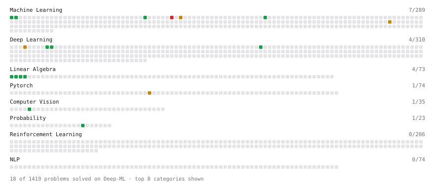

# Deep-ML

My machine learning practice from [Deep-ML](https://www.deep-ml.com). Every solution here was written by hand.

**22** solved · 19 problems · 0 labs · 3 math

[**Browse the interactive portfolio**](https://dereckduran.github.io/deep-ml/) to replay this filling in over time.

## Problems

| | Difficulty | Solved | |
| --- | --- | --- | --- |
| [Calculate Mean by Row or Column](https://www.deep-ml.com/problems/4) | easy | 2026-09-18 | [solution](problems/0004-calculate-mean-by-row-or-column) |
| [Compute Posterior Probability using Bayes' Theorem](https://www.deep-ml.com/problems/336) | easy | 2026-09-06 | [solution](problems/0336-compute-posterior-probability-using-bayes-theorem) |
| [Convert RGB Image to Grayscale](https://www.deep-ml.com/problems/237) | easy | 2026-08-16 | [solution](problems/0237-convert-rgb-image-to-grayscale) |
| [Derivatives of Activation Functions](https://www.deep-ml.com/problems/217) | easy | 2026-09-17 | [solution](problems/0217-derivatives-of-activation-functions) |
| [Detect Overfitting or Underfitting](https://www.deep-ml.com/problems/86) | easy | 2026-08-18 | [solution](problems/0086-detect-overfitting-or-underfitting) |
| [Early Stopping Based on Validation Loss Plateau](https://www.deep-ml.com/problems/199) | easy | 2026-08-19 | [solution](problems/0199-early-stopping-based-on-validation-loss-plateau) |
| [Implement ReLU Activation Function](https://www.deep-ml.com/problems/42) | easy | 2026-09-17 | [solution](problems/0042-implement-relu-activation-function) |
| [Leaky ReLU Activation Function](https://www.deep-ml.com/problems/44) | easy | 2026-09-17 | [solution](problems/0044-leaky-relu-activation-function) |
| [Linear Regression Using Gradient Descent](https://www.deep-ml.com/problems/15) | easy | 2026-09-13 | [solution](problems/0015-linear-regression-using-gradient-descent) |
| [Linear Regression Using Normal Equation](https://www.deep-ml.com/problems/14) | easy | 2026-09-13 | [solution](problems/0014-linear-regression-using-normal-equation) |
| [Matrix-Vector Dot Product](https://www.deep-ml.com/problems/1) | easy | 2026-08-16 | [solution](problems/0001-matrix-vector-dot-product) |
| [Reshape Matrix](https://www.deep-ml.com/problems/3) | easy | 2026-08-16 | [solution](problems/0003-reshape-matrix) |
| [Transpose of a Matrix](https://www.deep-ml.com/problems/2) | easy | 2026-08-16 | [solution](problems/0002-transpose-of-a-matrix) |
| [Implement Layer Normalization for Sequence Data](https://www.deep-ml.com/problems/109) | medium | 2026-09-17 | [solution](problems/0109-implement-layer-normalization-for-sequence-data) |
| [Implementing a Simple RNN](https://www.deep-ml.com/problems/54) | medium | 2026-09-22 | [solution](problems/0054-implementing-a-simple-rnn) |
| [Learning Curve Generator for Bias-Variance Diagnosis](https://www.deep-ml.com/problems/800) | medium | 2026-08-18 | [solution](problems/0800-learning-curve-generator-for-bias-variance-diagnosis) |
| [One Training Step](https://www.deep-ml.com/problems/1219) | medium | 2026-09-13 | [solution](problems/1219-one-training-step) |
| [Single Neuron with Backpropagation](https://www.deep-ml.com/problems/25) | medium | 2026-09-15 | [solution](problems/0025-single-neuron-with-backpropagation) |
| [Train Logistic Regression with Gradient Descent](https://www.deep-ml.com/problems/106) | hard | 2026-09-14 | [solution](problems/0106-train-logistic-regression-with-gradient-descent) |

## Math

| | Difficulty | Solved | |
| --- | --- | --- | --- |
| [Gradient Descent Updates](https://www.deep-ml.com/math-problems/5) | easy | 2026-09-06 | [solution](math/0005-gradient-descent-updates) |
| [Law of Large Numbers and Central Limit Theorem](https://www.deep-ml.com/math-problems/23) | medium | 2026-09-06 | [solution](math/0023-law-of-large-numbers-and-central-limit-theorem) |
| [Maximum Likelihood and MAP](https://www.deep-ml.com/math-problems/26) | hard | 2026-09-06 | [solution](math/0026-maximum-likelihood-and-map) |

---

_This file is regenerated by Deep-ML on every push._
